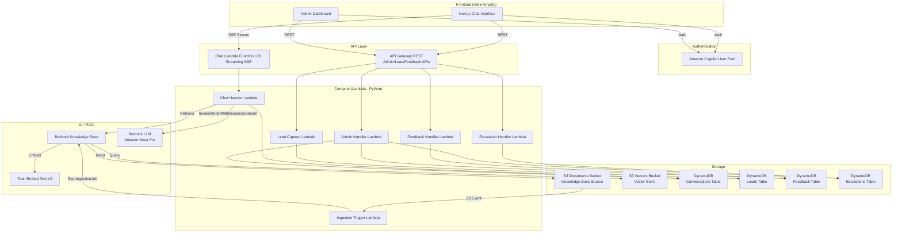

# Design Document: Learning Navigator

## Overview

The Learning Navigator is a serverless AI chatbot for the National Council for Mental Wellbeing's Learning Ecosystem. It uses Retrieval-Augmented Generation (RAG) to ground responses in official MHFA documentation, supports English and Spanish, personalizes interactions by user role, and provides an admin dashboard for analytics and conversation oversight.

The system follows a backend-first, serverless-first architecture using AWS CDK (TypeScript) for infrastructure, Python Lambda functions for compute, DynamoDB for persistence, S3 Vectors + Bedrock Knowledge Base for RAG, Amazon Cognito for authentication, and a Next.js frontend hosted on AWS Amplify.

## Architecture



### Key Architectural Decisions

1. **Lambda Function URL with streaming for chat** — The chat endpoint uses a Lambda Function URL with response streaming (SSE) rather than API Gateway. API Gateway does not support SSE streaming natively. The Function URL provides built-in HTTPS, streaming support, and lower latency for the chat use case.

2. **API Gateway for CRUD endpoints** — Admin, lead capture, feedback, and escalation endpoints use API Gateway REST API since they are standard request/response patterns that benefit from API Gateway's built-in request validation, throttling, and Cognito authorizer integration.

3. **S3 Vectors for vector store** — Using S3 Vectors (via `cdk-s3-vectors`) instead of OpenSearch Serverless. S3 Vectors is simpler to provision, lower cost for a PoC-scale knowledge base with 4 PDFs, and integrates natively with Bedrock Knowledge Base.

4. **Single CDK stack** — All resources in one stack for simplicity. The project scope (chatbot + admin dashboard) does not warrant multi-stack complexity.

5. **Amazon Nova Pro as LLM** — Cost-effective, supports streaming, good performance for RAG-grounded Q&A. Supports multilingual output for English/Spanish.

6. **Titan Embed Text V2 (1024 dimensions)** — Standard embedding model for Bedrock Knowledge Base. 1024 dimensions provides good retrieval quality for document-scale knowledge bases.

7. **DynamoDB single-table design per domain** — Separate tables for conversations, leads, feedback, and escalations. Each table has a clear access pattern and avoids complex GSI overloading for a PoC.

8. **Hierarchical chunking for Knowledge Base** — The KB documents (policy handbook, user guides, brand guidelines) are structured PDFs with clear section headings and nested content. Hierarchical chunking preserves parent-child relationships: child chunks (maxTokens=300) are used for semantic search, while parent chunks (maxTokens=1500) are returned for comprehensive context. This ensures policy rules, step-by-step procedures, and brand sections stay intact rather than being split at arbitrary token boundaries. Note: the Retrieve API may return fewer results than requested since one parent chunk can contain multiple child chunks.

## Components and Interfaces

### 1. Chat Handler Lambda (`chat-handler`)

Handles the core chat flow: receives user message, retrieves context from Knowledge Base, constructs a role-aware system prompt, streams the LLM response back via SSE, and persists the conversation turn.

**Interface:**
```python
# Request (POST to Function URL)
{
    "query": str,              # User message
    "session_id": str,         # Conversation session ID
    "language": str,           # "en" or "es"
}
# Headers: Authorization: Bearer <JWT>

# Response: SSE stream
# event: text-delta
# data: {"type": "text-delta", "content": "..."}
#
# event: citations
# data: {"type": "citations", "sources": [{"document": "...", "section": "..."}]}
#
# event: finish
# data: {"type": "finish", "message_id": "..."}
#
# event: error
# data: {"type": "error", "message": "..."}
```

**Flow:**
1. Validate JWT token from Authorization header
2. Extract user role from Cognito token claims
3. Call Bedrock KB `Retrieve` with user query
4. Build system prompt with role context, language instruction, and retrieved chunks
5. Call Bedrock `ConverseStream` with Amazon Nova Pro
6. Stream response chunks as SSE events
7. Extract citations from retrieval results
8. Send citations event
9. Persist full conversation turn (user message + assistant response) to DynamoDB
10. Send finish event

### 2. Admin Handler Lambda (`admin-handler`)

Serves the admin dashboard API: conversation logs, analytics aggregation, sentiment data, and escalation queue.

**Interface:**
```python
# GET /admin/conversations?start_date=...&end_date=...&role=...&language=...&sentiment=...
# GET /admin/conversations/{session_id}
# GET /admin/analytics?period=7d|30d|90d
# GET /admin/escalations?status=pending|resolved
# PATCH /admin/escalations/{escalation_id}  (mark resolved)
```

### 3. Lead Capture Lambda (`lead-capture`)

Captures contact information from unauthenticated or new users.

**Interface:**
```python
# POST /leads
{
    "name": str,
    "email": str,
    "area_of_interest": str,
    "session_id": str          # Optional, to link conversation
}

# Response
{
    "lead_id": str,
    "status": "captured"
}
```

### 4. Feedback Handler Lambda (`feedback-handler`)

Stores thumbs up/down ratings on individual messages.

**Interface:**
```python
# POST /feedback
{
    "message_id": str,
    "session_id": str,
    "rating": "positive" | "negative"
}
```

### 5. Escalation Handler Lambda (`escalation-handler`)

Records escalation requests with conversation context.

**Interface:**
```python
# POST /escalations
{
    "session_id": str,
    "summary": str,            # Auto-generated conversation summary
    "user_role": str,
    "contact_email": str
}
```

### 6. Ingestion Trigger Lambda (`ingestion-trigger`)

Triggered by S3 events when documents are added/updated in the knowledge base source bucket. Starts a Bedrock KB ingestion job.

**Interface:**
```python
# Triggered by S3 PutObject event on documents bucket
# Calls bedrock-agent StartIngestionJob
```

### 7. Frontend Components

| Component | Description |
|---|---|
| `ChatInterface` | Main chat view with message list, input bar, streaming display, citation rendering, feedback buttons |
| `MessageBubble` | Individual message with role-based styling, markdown rendering, citation links, feedback controls |
| `CitationPanel` | Expandable panel showing source documents referenced in a response |
| `LanguageSelector` | Dropdown to switch between English and Spanish |
| `LeadCaptureForm` | Modal form for unauthenticated users to submit contact info |
| `EscalationPrompt` | UI prompt when the bot offers to escalate, with confirmation flow |
| `AdminDashboard` | Dashboard layout with conversation logs, analytics charts, escalation queue |
| `ConversationLog` | Filterable, searchable list of past conversations |
| `AnalyticsPanel` | Charts for usage metrics, sentiment trends, feedback ratios |
| `SentimentBadge` | Visual indicator of conversation sentiment (positive/neutral/negative) |

## Data Models

### Conversations Table

Stores all chat messages. Partition key is `session_id`, sort key is `timestamp` for chronological retrieval.

```
Table: LearningNavigatorConversations
  PK: session_id (String)
  SK: timestamp (String, ISO 8601)

  Attributes:
    message_id: String (UUID)
    role: "user" | "assistant"
    content: String
    user_role: "instructor" | "internal_staff" | "learner"
    language: "en" | "es"
    citations: List<{document: String, section: String}> (assistant messages only)
    sentiment_score: Number (-1.0 to 1.0, user messages only)
    ttl: Number (epoch seconds, optional retention policy)

  GSI: RoleLanguageIndex
    PK: user_role
    SK: timestamp
    (For admin filtering by role + date range)
```

### Leads Table

Stores captured lead information.

```
Table: LearningNavigatorLeads
  PK: lead_id (String, UUID)
  SK: created_at (String, ISO 8601)

  Attributes:
    name: String
    email: String
    area_of_interest: String
    session_id: String (optional, links to conversation)
    status: "new" | "contacted" | "converted"
```

### Feedback Table

Stores per-message feedback ratings.

```
Table: LearningNavigatorFeedback
  PK: message_id (String)
  SK: session_id (String)

  Attributes:
    rating: "positive" | "negative"
    user_role: String
    created_at: String (ISO 8601)

  GSI: SessionFeedbackIndex
    PK: session_id
    SK: created_at
    (For retrieving all feedback in a session)
```

### Escalations Table

Stores escalation requests for admin follow-up.

```
Table: LearningNavigatorEscalations
  PK: escalation_id (String, UUID)
  SK: created_at (String, ISO 8601)

  Attributes:
    session_id: String
    summary: String
    user_role: String
    contact_email: String
    status: "pending" | "resolved"
    resolved_at: String (ISO 8601, optional)
    resolved_by: String (optional)

  GSI: StatusIndex
    PK: status
    SK: created_at
    (For admin queue filtering)
```


## Correctness Properties

*A property is a characteristic or behavior that should hold true across all valid executions of a system — essentially, a formal statement about what the system should do. Properties serve as the bridge between human-readable specifications and machine-verifiable correctness guarantees.*

### Property 1: SSE Response Stream Structure

*For any* valid chat request with a non-empty query and valid session_id, the chat handler response stream SHALL consist of zero or more `text-delta` events, followed by exactly one `citations` event, followed by exactly one `finish` event — in that order.

**Validates: Requirements 1.1**

### Property 2: Session Conversation Persistence

*For any* sequence of N messages sent with the same session_id, querying the Conversations table by that session_id SHALL return exactly N user messages and N assistant responses, each with a valid timestamp, and the messages SHALL be ordered chronologically.

**Validates: Requirements 1.2**

### Property 3: Citations Present When KB Returns Results

*For any* chat request where the Knowledge Base retrieval returns one or more document chunks, the response stream SHALL include a `citations` event with a non-empty `sources` array.

**Validates: Requirements 2.2**

### Property 4: Citation Rendering Includes Required Fields

*For any* citation object with `document` and `section` fields, the rendered citation component output SHALL contain both the document name string and the section identifier string.

**Validates: Requirements 2.3**

### Property 5: Language Parameter Controls Response Language

*For any* chat request with a `language` parameter, the system prompt sent to the LLM SHALL include an instruction to respond in the specified language. The system SHALL accept only "en" and "es" as valid language values and reject or default for any other value.

**Validates: Requirements 3.1, 3.2**

### Property 6: Language Switch Preserves Conversation Context

*For any* conversation with N messages, switching the language parameter on message N+1 SHALL NOT remove or alter any of the N previously stored messages in the Conversations table for that session.

**Validates: Requirements 3.4**

### Property 7: Role Extraction from JWT

*For any* valid JWT token containing a custom role claim, the chat handler SHALL extract the role value and use it to determine the user's role category (instructor, internal_staff, or learner).

**Validates: Requirements 4.1**

### Property 8: Role-Based System Prompt Construction

*For any* authenticated user with a known role (instructor, internal_staff, or learner), the system prompt constructed by the chat handler SHALL contain role-specific directives that differ from the directives used for other roles.

**Validates: Requirements 4.2, 4.3**

### Property 9: Escalation Record Persistence

*For any* escalation request with a valid session_id, summary, user_role, and contact_email, the Escalation_Service SHALL store a record in the Escalations table containing all four fields plus a generated escalation_id, created_at timestamp, and status of "pending".

**Validates: Requirements 5.2**

### Property 10: Admin Escalation Filtering by Status

*For any* set of escalation records with mixed statuses (pending and resolved), querying with status=pending SHALL return only records where status equals "pending", and the count of returned records SHALL equal the count of pending records in the dataset.

**Validates: Requirements 5.4**

### Property 11: Email Validation for Leads

*For any* string submitted as an email in a lead capture request, the Lead_Capture_Service SHALL accept the string only if it matches a valid email format (contains exactly one @ with non-empty local and domain parts), and SHALL reject all other strings with a validation error.

**Validates: Requirements 6.2**

### Property 12: Lead-Session Association

*For any* lead record stored with a non-null session_id, retrieving that lead record SHALL return the same session_id that was provided at creation time.

**Validates: Requirements 6.3**

### Property 13: Analytics Computation Correctness

*For any* set of conversation records in the database, the analytics endpoint SHALL return a total_conversations count equal to the number of distinct session_ids, and the average_session_duration SHALL equal the mean of (last_message_timestamp - first_message_timestamp) across all sessions.

**Validates: Requirements 7.1**

### Property 14: Conversation Log Filtering and Completeness

*For any* set of conversation records and any combination of filters (date range, user_role, language, sentiment score), every record returned by the admin conversations endpoint SHALL satisfy all applied filter criteria, and every record in the dataset that satisfies all filter criteria SHALL be included in the results. Each returned record SHALL contain timestamp, user_role, and language fields.

**Validates: Requirements 7.2, 7.4**

### Property 15: Sentiment Aggregation

*For any* set of user messages with sentiment scores and a specified time period, the sentiment aggregation endpoint SHALL return trend data where each data point's average sentiment equals the arithmetic mean of sentiment scores for messages within that time bucket.

**Validates: Requirements 7.3**

### Property 16: Feedback Storage Completeness

*For any* feedback submission with a valid message_id, session_id, rating, and user_role, the stored feedback record SHALL contain all four fields with values identical to the submission.

**Validates: Requirements 8.2**

### Property 17: Feedback Ratio Aggregation

*For any* set of feedback records over a time period, the feedback aggregation SHALL return a positive_count equal to the number of records with rating="positive" and a negative_count equal to the number of records with rating="negative", and the ratio SHALL equal positive_count divided by total_count.

**Validates: Requirements 8.3**

### Property 18: JWT Authentication Enforcement

*For any* API request to an authenticated endpoint (chat, admin, feedback, escalation), requests without a valid JWT token SHALL receive a 401 Unauthorized response, and requests with a valid JWT token SHALL not receive a 401 response.

**Validates: Requirements 9.1, 9.2**

### Property 19: Admin Access Restricted to Internal Staff

*For any* API request to an admin endpoint with a valid JWT token, the request SHALL be authorized only if the token's role claim is "internal_staff". Requests with any other role SHALL receive a 403 Forbidden response.

**Validates: Requirements 7.5**

### Property 20: PII Redaction in Logs

*For any* string containing email addresses or phone number patterns, the PII redaction function SHALL replace all occurrences with redacted placeholders, and the output string SHALL contain zero email addresses and zero phone number patterns.

**Validates: Requirements 9.5**

## Error Handling

### Chat Handler Errors

| Error Condition | Response | HTTP Status |
|---|---|---|
| Missing or invalid JWT token | `{"type": "error", "message": "Authentication required"}` | 401 |
| Missing required fields (query, session_id) | `{"type": "error", "message": "Missing required field: {field}"}` | 400 |
| Invalid language parameter | Default to "en", continue processing | N/A (graceful fallback) |
| Bedrock KB retrieval failure | SSE error event: `{"type": "error", "message": "Unable to search knowledge base"}` | 200 (SSE stream) |
| Bedrock LLM invocation failure | SSE error event: `{"type": "error", "message": "Unable to generate response"}` | 200 (SSE stream) |
| DynamoDB write failure for conversation | Log error, do not interrupt response stream | N/A (async) |
| Request timeout (>30s) | SSE error event with timeout message | 200 (SSE stream) |

### Admin Handler Errors

| Error Condition | Response | HTTP Status |
|---|---|---|
| Non-Internal_Staff role | `{"error": "Forbidden"}` | 403 |
| Invalid date range format | `{"error": "Invalid date format. Use ISO 8601"}` | 400 |
| Session not found | `{"error": "Session not found"}` | 404 |
| DynamoDB query failure | `{"error": "Internal server error"}` | 500 |

### Lead Capture Errors

| Error Condition | Response | HTTP Status |
|---|---|---|
| Invalid email format | `{"error": "Invalid email format"}` | 400 |
| Missing required fields | `{"error": "Missing required field: {field}"}` | 400 |
| DynamoDB write failure | `{"error": "Internal server error"}` | 500 |

### Feedback Handler Errors

| Error Condition | Response | HTTP Status |
|---|---|---|
| Invalid rating value | `{"error": "Rating must be 'positive' or 'negative'"}` | 400 |
| Missing message_id or session_id | `{"error": "Missing required field: {field}"}` | 400 |
| Message not found | `{"error": "Message not found"}` | 404 |

### Escalation Handler Errors

| Error Condition | Response | HTTP Status |
|---|---|---|
| Missing required fields | `{"error": "Missing required field: {field}"}` | 400 |
| Invalid email format | `{"error": "Invalid email format"}` | 400 |
| Session not found | `{"error": "Session not found"}` | 404 |

### General Error Handling Patterns

- All Lambda handlers use structured JSON logging with `timestamp`, `request_id`, `step`, `status`, `error_type`, and `message` fields
- PII is redacted from all log output before writing
- All errors return consistent response shapes with `error` field
- CORS headers are included in all responses including error responses
- Retry with exponential backoff for transient AWS service errors (DynamoDB throttling, Bedrock throttling)

## Testing Strategy

### Property-Based Testing

**Library:** [Hypothesis](https://hypothesis.readthedocs.io/) for Python Lambda functions, [fast-check](https://fast-check.dev/) for TypeScript/frontend components.

**Configuration:** Minimum 100 iterations per property test.

**Tag format:** Each test is annotated with a comment: `# Feature: learning-navigator, Property {N}: {title}`

Property-based tests validate universal correctness properties across randomly generated inputs. Each property from the Correctness Properties section maps to one property-based test.

**Backend property tests (Hypothesis):**
- Property 1: SSE stream structure — generate random queries, verify event ordering
- Property 2: Session persistence — generate message sequences, verify DynamoDB state
- Property 3: Citations presence — generate queries with mocked KB results, verify citations event
- Property 5: Language parameter — generate language codes, verify prompt construction
- Property 6: Language switch — generate conversation sequences with language changes, verify persistence
- Property 7: Role extraction — generate JWT payloads with various role claims, verify extraction
- Property 8: Role-based prompts — generate role values, verify prompt differentiation
- Property 9: Escalation persistence — generate escalation payloads, verify stored fields
- Property 10: Escalation filtering — generate mixed-status escalation sets, verify filter correctness
- Property 11: Email validation — generate random strings, verify accept/reject behavior
- Property 12: Lead-session association — generate leads with session IDs, verify round-trip
- Property 13: Analytics computation — generate conversation datasets, verify metric calculations
- Property 14: Conversation filtering — generate conversations with varied attributes, verify filter correctness
- Property 15: Sentiment aggregation — generate sentiment scores with timestamps, verify aggregation
- Property 16: Feedback storage — generate feedback payloads, verify stored fields
- Property 17: Feedback ratio — generate feedback datasets, verify ratio computation
- Property 18: JWT enforcement — generate valid/invalid tokens, verify 401 behavior
- Property 19: Admin access control — generate tokens with various roles, verify 403 for non-staff
- Property 20: PII redaction — generate strings with embedded PII patterns, verify redaction

**Frontend property tests (fast-check):**
- Property 4: Citation rendering — generate citation objects, verify rendered output contains required fields

### Unit Testing

**Libraries:** `pytest` for Python, `@testing-library/react` + `jest` for frontend.

Unit tests cover specific examples, edge cases, and integration points:

- **Edge cases from requirements:**
  - Empty KB retrieval results → fallback message (1.4, 2.4)
  - Missing role claim in JWT → default to learner (4.4)
  - User declines lead capture → conversation continues (6.4)
  - Token expiry mid-session → re-auth prompt (9.6)

- **UI examples:**
  - Welcome message renders with role-specific prompts (1.3)
  - Loading indicator appears on message send (1.5)
  - Feedback buttons render on assistant messages (8.1)
  - Browser language detection pre-selects language (3.3)
  - ARIA live region announces new messages (10.4)
  - Ingestion trigger fires on S3 event (2.5)
  - Escalation confirmation message displays (5.3)

- **Integration tests:**
  - Full chat flow: send message → receive stream → verify persistence
  - Lead capture flow: submit form → verify DynamoDB record
  - Admin dashboard: create test data → verify API responses
