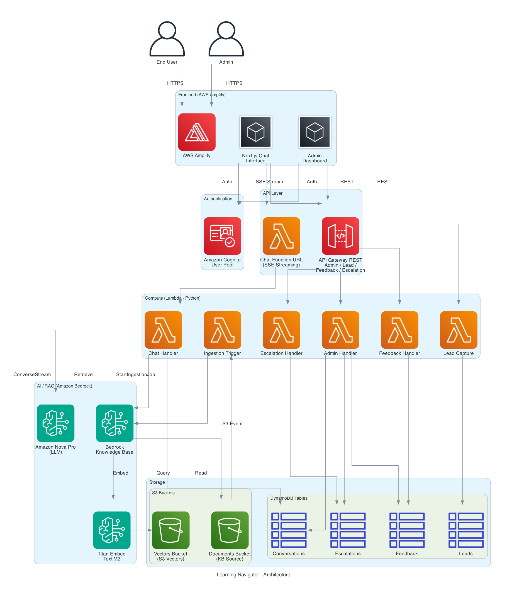

# Architecture Deep Dive

This document provides a detailed explanation of the Learning Navigator architecture, services used, data flows, and architectural decisions.

---

## Architecture Diagram



---

## Architecture Flow

### 1. User Interaction

Users access the Learning Navigator through a Next.js web application hosted on AWS Amplify. On first visit, users authenticate via Amazon Cognito (email + password). The Cognito ID token carries a `custom:role` claim (`instructor`, `internal_staff`, or `learner`) that drives role-based personalization throughout the system.

Unauthenticated users can still interact with the lead capture form, which does not require a JWT.

### 2. Chat Request Processing

When a user sends a message, the frontend streams the request to the Chat Handler Lambda via a Lambda Function URL (SSE streaming). The flow is:

1. JWT validation against Cognito JWKS
2. Role extraction from `custom:role` claim (defaults to `learner`)
3. Input validation (query, session_id, language)
4. RAG retrieval from Bedrock Knowledge Base
5. Role-based system prompt construction with retrieved context
6. SSE streaming response via Bedrock ConverseStream (Amazon Nova Pro)
7. Conversation persistence to DynamoDB

### 3. RAG Knowledge Retrieval

The Bedrock Knowledge Base uses S3 Vectors for vector storage and Amazon Titan Embed Text V2 for embeddings. Documents are chunked using a hierarchical strategy:

- Parent chunks (1500 tokens): capture full sections and policies
- Child chunks (300 tokens): granular paragraphs for semantic search
- Search is performed on child chunks; parent chunks are returned for comprehensive context

This approach is optimized for structured PDFs like policy handbooks, user guides, and brand guidelines.

### 4. Document Ingestion

When documents are uploaded to the S3 documents bucket, an S3 PutObject event triggers the Ingestion Trigger Lambda, which calls `bedrock:StartIngestionJob` to re-index the Knowledge Base. Initial documents are deployed via CDK `BucketDeployment`.

### 5. Admin Dashboard

Internal staff access the admin dashboard at `/admin`, which provides:

- Conversation logs with filtering (date range, role, language, sentiment)
- Usage analytics (total conversations, active sessions, average duration)
- Sentiment trend aggregation over configurable time periods
- Feedback ratio analytics (positive/negative over time)
- Escalation queue management (view pending, mark resolved)

All admin endpoints are protected by Cognito authentication and Lambda-level role verification (`internal_staff` only).

### 6. Supporting Services

- Lead Capture: unauthenticated endpoint for prospective users to submit contact info
- Feedback: authenticated users rate responses (thumbs up/down)
- Escalation: authenticated users request human support with conversation context

---

## Cloud Services / Technology Stack

### Frontend

- Next.js (App Router): React framework with SSR support, hosted on AWS Amplify
- TypeScript: strict mode, path aliases (`@/*`)
- Tailwind CSS: utility-first styling
- react-i18next: internationalization (English/Spanish)
- react-markdown: markdown rendering for chat responses
- AWS Amplify UI: Cognito authentication components
- AWS Amplify JS: auth session management (`fetchAuthSession`, `getCurrentUser`)

### Backend Infrastructure

- AWS CDK (TypeScript): single stack (`NavStack`) defining all infrastructure
- cdk-nag (`AwsSolutionsChecks`): automated security compliance scanning on every synth/deploy

### Compute

- AWS Lambda (Python 3.13): six functions, all serverless
  - Chat Handler: RAG chat with SSE streaming via Function URL
  - Lead Capture: unauthenticated lead form submission
  - Feedback Handler: thumbs up/down rating storage
  - Escalation Handler: escalation request creation
  - Admin Handler: dashboard API (conversations, analytics, sentiment, feedback, escalations)
  - Ingestion Trigger: S3 event-driven KB re-indexing

### AI/ML Services

- Amazon Bedrock Knowledge Base: RAG pipeline with hierarchical chunking
- Amazon Titan Embed Text V2: embedding model (1024 dimensions)
- Amazon Nova Pro (`us.amazon.nova-pro-v1:0`): LLM for chat inference via ConverseStream
- S3 Vectors: serverless vector storage with cosine distance metric

### API Layer

- API Gateway REST API: CRUD endpoints for leads, feedback, escalations, and admin routes
  - Cognito User Pool Authorizer for authenticated endpoints
  - Throttling: 100 req/s rate, 50 burst
- Lambda Function URL: SSE streaming for chat (API Gateway does not support SSE)

### Data Storage

- Amazon DynamoDB (4 tables, PAY_PER_REQUEST billing):
  - Conversations: PK=`session_id`, SK=`timestamp`, GSI `RoleLanguageIndex`
  - Leads: PK=`lead_id`, SK=`created_at`
  - Feedback: PK=`message_id`, SK=`session_id`, GSI `SessionFeedbackIndex`
  - Escalations: PK=`escalation_id`, SK=`created_at`, GSI `StatusIndex`
- Amazon S3 (3 buckets):
  - Documents bucket: KB source PDFs (versioned, BPA, enforceSSL, access logging)
  - Vectors bucket: S3 Vectors index storage
  - Access logs bucket: audit trail for documents bucket

### Authentication

- Amazon Cognito User Pool: email-based sign-up, custom `role` attribute
- User Pool Client: SRP and password auth flows

### Hosting

- AWS Amplify Hosting (WEB_COMPUTE): Next.js SSR with GitHub CI/CD
  - Monorepo support via `AMPLIFY_MONOREPO_APP_ROOT`
  - Auto-build trigger via AwsCustomResource on CDK deploy

---

## Infrastructure as Code

### CDK Stack Structure

```
backend/
├── bin/
│   └── backend.ts              # CDK app entry point
├── lib/
│   └── backend-stack.ts        # NavStack — single stack with all resources
├── lambda/
│   ├── chat-handler/index.py
│   ├── lead-capture/index.py
│   ├── feedback-handler/index.py
│   ├── escalation-handler/index.py
│   ├── admin-handler/index.py
│   └── ingestion-trigger/index.py
├── cdk.json
├── package.json
└── tsconfig.json
```

### Key CDK Constructs

1. DynamoDB Tables: L2 `Table` with GSIs, PAY_PER_REQUEST, encryption, PITR
2. S3 Buckets: L2 `Bucket` with BPA, enforceSSL, versioning, access logging
3. S3 Vectors: L3 `VectorsBucket` and `VectorIndex` from `cdk-s3-vectors`
4. Bedrock KB: L1 `CfnKnowledgeBase` with `addPropertyOverride` for S3 Vectors config
5. Cognito: L2 `UserPool` with custom `role` attribute
6. Lambda Functions: L2 `Function` with Python 3.13, dynamic architecture detection
7. Lambda Function URL: streaming invoke mode for SSE chat
8. API Gateway: L2 `RestApi` with Cognito authorizer
9. Amplify: L1 `CfnApp`/`CfnBranch` with monorepo buildSpec
10. BucketDeployment: initial KB document upload from `knowledge_base_docs/`

---

## Security Considerations

- Authentication: Cognito JWT validation on every request; ID token carries `custom:role`
- Authorization: Lambda-level role checks for admin endpoints (`internal_staff` only)
- IAM Least Privilege: CDK grant methods (`grantReadWriteData`, `grantRead`); specific ARNs for Bedrock models
- Encryption at Rest: AWS-managed encryption on all DynamoDB tables and S3 buckets
- Encryption in Transit: enforceSSL on all S3 buckets; HTTPS on all endpoints
- PII Redaction: email and phone patterns redacted from CloudWatch log output
- Input Sanitization: HTML tag stripping, length limits, prompt injection separation
- cdk-nag: `AwsSolutionsChecks` runs on every synth; findings fixed or suppressed with ADR rationale
- CORS: configured on Function URL and API Gateway for Amplify URL + localhost
- Access Logging: S3 server access logs on documents bucket

---

## Scalability

- Auto-scaling: all compute is Lambda (scales to concurrent invocations automatically)
- DynamoDB: PAY_PER_REQUEST billing scales reads/writes on demand
- S3 Vectors: serverless vector storage, no cluster management
- Bedrock: managed service, scales with request volume
- Amplify: managed hosting with automatic scaling for SSR

---

## Architectural Decisions

### ADR 1: S3 Vectors for RAG Vector Storage

**Status**: Accepted

**Context**: The system needs vector storage for RAG retrieval. Options include OpenSearch Serverless, Pinecone, or S3 Vectors.

**Decision**: Use S3 Vectors with `cdk-s3-vectors` L3 construct.

**Alternatives Considered**:
1. OpenSearch Serverless: higher cost, operational overhead for cluster management
2. Pinecone: external dependency, additional vendor relationship

**Rationale**: Serverless, no cluster management, cost-effective for chatbot workload, native AWS integration with Bedrock KB.

**Consequences**:
- Positive: zero operational overhead, pay-per-use, CDK L3 construct simplifies setup
- Negative: newer service, CDK L1 types don't include S3VectorsConfiguration yet (requires `addPropertyOverride`)

---

### ADR 2: Hierarchical Chunking Strategy

**Status**: Accepted

**Context**: MHFA documentation includes structured PDFs (policy handbooks, user guides, brand guidelines). Chunking strategy affects retrieval quality.

**Decision**: Use HIERARCHICAL chunking with parent (1500 tokens) and child (300 tokens) chunks.

**Alternatives Considered**:
1. FIXED_SIZE chunking: loses document structure context
2. SEMANTIC chunking: higher latency, less predictable chunk boundaries

**Rationale**: Parent chunks capture full sections/policies; child chunks enable granular semantic search. Search on children, return parents for comprehensive context. Ideal for structured PDFs.

---

### ADR 3: Lambda Function URL for Chat Streaming

**Status**: Accepted

**Context**: Chat responses need to stream incrementally via SSE. API Gateway does not support SSE natively.

**Decision**: Use Lambda Function URL with streaming invoke mode for the chat endpoint.

**Alternatives Considered**:
1. API Gateway + WebSocket: more complex, SSE is simpler for unidirectional streaming
2. All endpoints via Function URLs: loses API Gateway throttling and Cognito authorizer integration

**Rationale**: Function URL provides built-in HTTPS, streaming support, and lower latency. Non-streaming endpoints use API Gateway for its throttling and authorizer features.

---

### ADR 4: Amazon Nova Pro for Chat Inference

**Status**: Accepted

**Context**: Need an LLM for RAG-augmented chat responses with streaming support.

**Decision**: Use Amazon Nova Pro (`us.amazon.nova-pro-v1:0`) via Bedrock ConverseStream with inference profile ARN.

**Alternatives Considered**:
1. Claude 3 Sonnet: higher cost per token
2. Foundation model ARN: returns ValidationException for on-demand Nova Pro (requires inference profile)

**Rationale**: Nova Pro provides good quality at lower cost; inference profile is required for on-demand invocation.

---

### ADR 5: Cognito with Custom Role Attribute

**Status**: Accepted

**Context**: Users have three roles (instructor, internal_staff, learner) that drive personalization.

**Decision**: Use Cognito User Pool with `custom:role` string attribute. Pass ID token (not access token) for all authenticated requests.

**Alternatives Considered**:
1. Separate user profile DynamoDB table: unnecessary complexity
2. Access token: lacks custom claims, causes API Gateway authorizer CORS errors

**Rationale**: Managed auth service; custom attribute enables role-based personalization without a separate user profile table. ID token carries `custom:role` claim needed for role extraction.

---

### ADR 6: Amplify Hosting with WEB_COMPUTE Platform

**Status**: Accepted

**Context**: Frontend is a Next.js SSR application that needs hosting with CI/CD.

**Decision**: Use Amplify Hosting with `WEB_COMPUTE` platform, L1 `CfnApp`/`CfnBranch`, and AwsCustomResource for auto-build on CDK deploy.

**Alternatives Considered**:
1. S3 + CloudFront: no built-in CI/CD or SSR support
2. `@aws-cdk/aws-amplify-alpha`: alpha stability risk

**Rationale**: Managed hosting with CI/CD from GitHub, automatic HTTPS, SSR support. No custom rewrite rules needed (Amplify compute layer handles SSR routing). `enableAutoBuild` only fires on git pushes, so AwsCustomResource triggers builds on CDK deploy to pick up environment variable changes.

---

### ADR 7: PAY_PER_REQUEST DynamoDB Billing

**Status**: Accepted

**Context**: Chatbot traffic patterns are unpredictable.

**Decision**: Use PAY_PER_REQUEST billing for all DynamoDB tables.

**Alternatives Considered**:
1. Provisioned capacity: requires traffic estimation upfront, risk of over/under-provisioning

**Rationale**: Avoids over-provisioning; scales automatically with demand; appropriate for PoC with unknown traffic patterns.

---

### ADR 8: Wildcard CORS for PoC

**Status**: Accepted (to be tightened for production)

**Context**: Amplify app URL is constructed from `appId` which creates a circular dependency if used in API Gateway/Function URL CORS config during CDK deploy.

**Decision**: Use wildcard (`*`) CORS origins for PoC.

**Alternatives Considered**:
1. Amplify URL in corsOrigins: creates CloudFormation circular dependency

**Rationale**: Avoids circular dependency. Will tighten to specific origins for production deployment.
