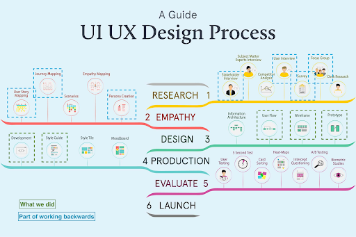

**Project Completion Documentation** 

[INSERT_PROJECT_NAME]

 [INSERT_CLIENT_LOGO]


**Authors:** 

**[INSERT_TEAM_MEMBER_NAMES]**

**Project Closure Date:**

**[INSERT_DATE]**

### 

**Table of Contents**

**1[. Executive Summary](#1-executive-summary)**

**2[. Project Overview](#2-project-overview)**

2[.1 AWS Leads](#21-aws-leads)

2[.2 ASU Build Team](#22-asu-build-team)

2[.3 Project Timeline](#23-project-timeline)

2[.4 Project Timeline and Sprints](#24-project-timeline-and-sprints)

[**3\. Project Performance**](#3-project-performance)

[3.1 Problem Statement](#31-problem-statement)

[3.2 Project Scope](#32-project-scope)

[3.3 Deliverables](#33-deliverables)

[**4\. Development**](#4-development)

[4.1 UI/UX](#41-uiux)

[4.2 System Architecture](#42-system-architecture)

[4.3 Technology Stack](#43-technology-stack)

[4.4 Key Features Implementation](#44-key-features-implementation)

[4.5 Deployment](#45-deployment)

[**5\. Challenges**](#5-challenges)

[**6\. Future Scope**](#6-future-scope)

[**7\. Appendix**](#7-appendix)

### 

### **1\. Executive Summary** {#1-executive-summary}

### ---

The Learning Navigator is an AI-powered chatbot assistant developed for the National Council for Mental Wellbeing to support their Mental Health First Aid (MHFA) program. The National Council is a leading organization in mental health advocacy and training, providing MHFA certification to instructors across the United States.

The project addresses the challenge of providing timely, accurate guidance to MHFA instructors, internal staff, and learners who need quick answers about training resources, policies, and procedures. Previously, users had to manually search through multiple PDF documents and handbooks, leading to delays and potential inconsistencies in information access.

The Learning Navigator solution leverages Amazon Bedrock's Retrieval-Augmented Generation (RAG) capabilities to provide real-time, contextually relevant answers grounded in official MHFA documentation. The system features bilingual support (English and Spanish), role-based personalization, conversation analytics, and an admin dashboard for oversight.

Key capabilities delivered include:
- AI-powered chat interface with streaming responses using Amazon Nova Pro
- RAG-based knowledge retrieval from MHFA documentation using Bedrock Knowledge Base with S3 Vectors
- Role-based personalization for instructors, internal staff, and learners
- Bilingual support with English and Spanish interfaces
- Lead capture for prospective users
- Feedback collection and sentiment analysis
- Escalation workflow for complex issues requiring human support
- Admin dashboard with conversation logs, analytics, and escalation queue

The solution reduces the time instructors spend searching for information, improves consistency in guidance provided, and enables the National Council team to monitor chatbot performance and identify areas for improvement through comprehensive analytics.

### 

### **2\. Project Overview**

---

 {#2-project-overview}

#### **2.1 AWS Leads** {#21-aws-leads}

[INSERT_AWS_TEAM_MEMBERS - List AWS team members and their roles]

**Example:**
- [Name] – Solution Architect
- [Name] – Digital Innovation Lead
- [Name] – Project Manager
- [Name] – Account Manager

#### **2.2 ASU Build Team** {#22-asu-build-team}

[INSERT_ASU_TEAM_MEMBERS - List ASU team members and their roles]

**Example:**
- [Name] – Full Stack Developer
- [Name] – UI/UX Designer

#### **2.3 Project Timeline** {#23-project-timeline}

[INSERT_START_DATE - DD-Month-YY] - [INSERT_END_DATE - DD-Month-YY]

#### **2.4 Project Timeline and Sprints** {#24-project-timeline-and-sprints}

[INSERT_SPRINT_TABLE - Add the project timeline table]

| Item # | Iterations | Deliverables | Date planned |
| :---- | :---- | :---- | :---- |
| **1** | **Pre POC** | [INSERT_DELIVERABLES] | **[INSERT_DATE]** |
| **2** | **Week 1** | [INSERT_DELIVERABLES] | **[INSERT_DATE]** |
| **3** | **Week 2** | [INSERT_DELIVERABLES] | **[INSERT_DATE]** |
| **4** | **Week 3** | [INSERT_DELIVERABLES] | **[INSERT_DATE]** |
| **5** | **Week 4-6** | [INSERT_DELIVERABLES] | **[INSERT_DATE]** |

### 

### **3\. Project Performance** {#3-project-performance}

### ---

### 

#### **3.1 Problem Statement** {#31-problem-statement}

The National Council for Mental Wellbeing's MHFA program serves thousands of certified instructors who regularly need access to training resources, policy information, and operational guidance. The existing documentation was distributed across multiple PDF files including instructor handbooks, learner guides, and platform user guides.

Key challenges included:
- **Information Fragmentation**: Critical information scattered across multiple PDF documents, making it time-consuming for instructors to find specific guidance
- **Manual Search Burden**: Instructors had to manually search through lengthy documents to answer questions about course management, policies, and procedures
- **Language Barriers**: Spanish-speaking instructors and learners lacked easy access to information in their preferred language
- **Delayed Support**: Questions requiring human intervention had no structured escalation path, leading to delays in resolution
- **Limited Visibility**: The National Council team had no insight into common questions, pain points, or areas where documentation was unclear

These limitations impacted instructor productivity, potentially led to inconsistent application of policies, and created friction in the learning experience for both instructors and learners. The need for an intelligent, accessible, and bilingual solution that could provide instant answers while capturing analytics became clear.

#### **3.2 Project Scope** {#32-project-scope}

##### **In Scope**

- AI-powered conversational chat interface with streaming responses
- Retrieval-Augmented Generation (RAG) using Amazon Bedrock Knowledge Base
- Integration of MHFA documentation (instructor handbooks, learner guides, connect user guides)
- Bilingual support (English and Spanish) with language switching
- Role-based personalization for instructors, internal staff, and learners
- User authentication via Amazon Cognito with custom role attributes
- Lead capture form for unauthenticated prospective users
- Feedback collection (thumbs up/down) on chatbot responses
- Escalation workflow for issues requiring human support
- Admin dashboard with conversation logs, analytics, and escalation queue
- Citation display showing source documents for AI responses
- Serverless AWS infrastructure deployed via CDK
- Next.js frontend hosted on AWS Amplify
- Security controls including encryption at rest, HTTPS enforcement, and IAM least privilege

##### **Out of Scope**

- Integration with external CRM or ticketing systems (Zendesk, Salesforce)
- Automated ticket creation in support systems (manual follow-up required)
- Real-time human chat handoff (escalations are asynchronous)
- Mobile native applications (responsive web only)
- Voice interface or speech-to-text capabilities
- Integration with MHFA course management systems
- Automated content updates from external sources
- Multi-region deployment (single region deployment)
- Advanced analytics and machine learning on conversation data
- Custom model fine-tuning (uses foundation models as-is)

#### **3.3 Deliverables** {#33-deliverables}

* Fully functional web application with AI-powered chat interface
* AWS serverless infrastructure deployed via CDK (TypeScript)
* Six Lambda functions (Python 3.13) for backend compute
* Amazon Bedrock Knowledge Base with S3 Vectors for RAG
* Four DynamoDB tables for data persistence (Conversations, Leads, Feedback, Escalations)
* Amazon Cognito user pool with custom role attribute
* API Gateway REST API with Cognito authorizer
* Lambda Function URL with SSE streaming for real-time chat
* Next.js frontend application with TypeScript
* AWS Amplify hosting configuration with CI/CD
* Bilingual support (English and Spanish) with react-i18next
* Admin dashboard for conversation logs, analytics, and escalation management
* Complete documentation suite:
  - Architecture deep dive with 8 ADRs
  - API reference for all endpoints
  - Deployment guide with step-by-step instructions
  - User guide for end users and administrators
  - Modification guide for developers
  - Project closure documentation
* Source code repository with MIT license
* Security controls including cdk-nag integration, encryption at rest, and IAM least privilege
* Knowledge base populated with MHFA documentation (4 PDF files)

### 

### **4\. Development** {#4-development}

---

#### 

#### **4.1 UI/UX** {#41-uiux}

#### ---

#### 



#### **Who are the users of this application?**

The Learning Navigator serves three primary user personas:

1. **MHFA Instructors**: Certified Mental Health First Aid instructors who teach MHFA courses and need quick access to policy information, course management guidance, invoicing procedures, and training resources. They represent the largest user group and require instructor-specific content prioritization.

2. **Internal Staff**: National Council for Mental Wellbeing employees who support training operations, manage instructor relationships, and oversee the MHFA program. They need access to operational data, analytics, conversation logs, and administrative tools to monitor chatbot performance and respond to escalations.

3. **Learners**: Individuals enrolled in or completing MHFA training programs who need guidance on course materials, certification processes, and general MHFA information. They receive general educational content without instructor-specific details.

All users benefit from bilingual support (English and Spanish), with the system detecting browser language preferences and allowing manual language switching.

#### **Why are the users using this application?**

Users interact with the Learning Navigator to:

- **Get instant answers** to questions about MHFA training, policies, and procedures without manually searching through PDF documents
- **Access role-specific guidance** tailored to their needs (instructor policies, operational procedures, or learner information)
- **Receive information in their preferred language** (English or Spanish) for better comprehension
- **Find source references** through citations that link back to official MHFA documentation
- **Escalate complex issues** to human support when the chatbot cannot resolve their question
- **Provide feedback** on response quality to help improve the system
- **Monitor system performance** (internal staff only) through analytics, conversation logs, and escalation queues

The application reduces the time spent searching for information, improves consistency in guidance provided, and enables data-driven improvements to documentation and training resources.

#### **What is the customer opportunity statement?**

The National Council for Mental Wellbeing seeks to enhance the MHFA instructor and learner experience by providing instant, accurate, and accessible guidance through an AI-powered assistant. By reducing the friction in accessing critical information, the Learning Navigator enables instructors to focus on teaching rather than administrative tasks, improves consistency in policy application, and provides the National Council team with valuable insights into common questions and pain points. This solution positions the National Council as an innovative leader in mental health training while improving operational efficiency and user satisfaction.

#### **User Interface**

[INSERT_UI_SCREENSHOTS - Add screenshots of key interfaces with descriptions]


> **[PLACEHOLDER]** Add screenshot with caption


> **[PLACEHOLDER]** Add screenshot with caption

#### 

#### **4.2 System Architecture** {#42-system-architecture}

The Learning Navigator is built on a serverless AWS architecture that prioritizes scalability, cost-effectiveness, and operational simplicity. The system follows a three-tier architecture with a Next.js frontend, serverless backend compute, and managed AWS services for data storage and AI capabilities.

The architecture leverages Amazon Bedrock for AI capabilities, using Retrieval-Augmented Generation (RAG) to ground chatbot responses in official MHFA documentation. The Knowledge Base uses S3 Vectors for vector storage, providing a serverless alternative to OpenSearch with lower operational overhead. All infrastructure is defined as code using AWS CDK (TypeScript), enabling reproducible deployments and version-controlled infrastructure changes.

Key architectural decisions include:
- Lambda Function URLs with streaming support for real-time chat (SSE) instead of API Gateway WebSocket
- Hierarchical chunking strategy (1500 token parents, 300 token children) for optimal RAG retrieval
- PAY_PER_REQUEST billing for DynamoDB to handle unpredictable traffic patterns
- Cognito custom attributes for role-based personalization without a separate user profile table
- Amplify Hosting with WEB_COMPUTE platform for Next.js SSR support

##### **Architecture Diagram**


##### **Workflow Description**

1. **User Authentication**: User accesses the application and authenticates via Amazon Cognito. The ID token contains a custom:role attribute (instructor, internal_staff, or learner) used for personalization.

2. **Chat Interaction**: User sends a message through the Next.js frontend. The message is sent to the Chat Handler Lambda via Function URL with SSE streaming enabled.

3. **RAG Retrieval**: Chat Handler queries the Bedrock Knowledge Base, which retrieves relevant document chunks from S3 Vectors using semantic search with Titan Embed Text V2 embeddings.

4. **AI Generation**: Retrieved context is passed to Amazon Nova Pro via Bedrock Converse API. The model generates a response grounded in the documentation, which is streamed back to the frontend in real-time.

5. **Citation Display**: Source references from the RAG retrieval are displayed alongside the response, allowing users to verify information against official documents.

6. **Feedback Collection**: User can rate the response (thumbs up/down). Feedback is stored in DynamoDB via the Feedback Handler Lambda.

7. **Escalation (Optional)**: If the chatbot cannot resolve the issue, user can escalate to human support. Escalation details are stored in DynamoDB and appear in the admin dashboard.

8. **Admin Dashboard**: Internal staff access the admin dashboard to view conversation logs, analytics, feedback trends, and pending escalations. Data is retrieved from DynamoDB via the Admin Handler Lambda.

9. **Knowledge Base Updates**: When new documents are uploaded to the S3 documents bucket, the Ingestion Trigger Lambda automatically starts a Bedrock Knowledge Base ingestion job to update the vector index.

#### 

#### **4.3 Technology Stack** {#43-technology-stack}

##### **Frontend**
- **Next.js 15**: React framework with App Router for server-side rendering and static site generation
- **TypeScript**: Strict type checking for improved code quality and developer experience
- **Tailwind CSS**: Utility-first CSS framework for responsive design
- **react-i18next**: Internationalization library for bilingual support (English and Spanish)
- **AWS Amplify UI**: Pre-built authentication components for Cognito integration
- **Hosting**: AWS Amplify with WEB_COMPUTE platform for Next.js SSR support and CI/CD from GitHub

##### **Backend Services**
- **AWS Lambda**: Serverless compute with Python 3.13 runtime for all backend functions
  - Chat Handler: SSE streaming with Bedrock integration
  - Lead Capture: Unauthenticated contact form processing
  - Feedback Handler: Rating collection and storage
  - Escalation Handler: Human support escalation workflow
  - Admin Handler: Dashboard data aggregation
  - Ingestion Trigger: S3 event-driven Knowledge Base updates
- **API Gateway**: REST API with Cognito authorizer for authenticated endpoints
- **Lambda Function URLs**: Direct HTTPS endpoints with streaming support for chat SSE

##### **Data Storage**
- **Amazon DynamoDB**: NoSQL database with PAY_PER_REQUEST billing
  - Conversations table: Chat message history with RoleLanguageIndex GSI
  - Leads table: Contact information from prospective users
  - Feedback table: Response ratings with SessionFeedbackIndex GSI
  - Escalations table: Human support requests with StatusIndex GSI
- **Amazon S3**: Object storage for documents and vectors
  - Documents bucket: Source PDFs for Knowledge Base (versioned, encrypted)
  - S3 Vectors bucket: Vector embeddings for RAG retrieval
  - Access logs bucket: Audit trail for S3 access

##### **AI/ML Services**
- **Amazon Bedrock Knowledge Base**: RAG orchestration with hierarchical chunking (1500/300 token parent/child)
- **Amazon Nova Pro**: Foundation model for chat generation via Converse API with streaming
- **Titan Embed Text V2**: Embedding model for semantic search (1024 dimensions)
- **S3 Vectors**: Serverless vector store with cosine distance metric

##### **Authentication & Security**
- **Amazon Cognito**: User pool with email sign-in and custom:role attribute
- **AWS Secrets Manager**: GitHub OAuth token storage for Amplify
- **AWS IAM**: Least privilege roles with CDK grant methods
- **Encryption**: AWS-managed keys for DynamoDB and S3, TLS enforcement on all endpoints

##### **Infrastructure**
- **AWS CDK**: Infrastructure as Code with TypeScript for reproducible deployments
- **cdk-nag**: Automated security scanning integrated in the stack
- **CloudWatch Logs**: Centralized logging with 30-day retention
- **cdk-s3-vectors**: Third-party construct for S3 Vectors bucket and index management

#### 

#### **4.4 Key Features Implementation** {#44-key-features-implementation}

##### **Feature 1: RAG-Powered Conversational Chat**
The core chat experience uses Amazon Bedrock's Retrieval-Augmented Generation to provide accurate, grounded responses. When a user sends a message, the Chat Handler Lambda queries the Knowledge Base to retrieve relevant document chunks using semantic search. These chunks are passed as context to Amazon Nova Pro, which generates a response that cites the source material. The response is streamed back to the frontend using Server-Sent Events (SSE) via Lambda Function URL, providing a real-time typing effect. Citations are extracted from the retrieval results and displayed alongside the response, allowing users to verify information against official MHFA documentation.

##### **Feature 2: Role-Based Personalization**
The system tailors responses based on the authenticated user's role (instructor, internal_staff, or learner) stored in the Cognito custom:role attribute. The Chat Handler includes the user role in the system prompt sent to the AI model, instructing it to prioritize role-specific content. For example, instructors receive guidance on course management and invoicing, while learners receive general educational content. This personalization happens without a separate user profile database, leveraging Cognito's custom attributes for simplicity.

##### **Feature 3: Bilingual Support (English and Spanish)**
The application supports English and Spanish through react-i18next with translation files stored in `frontend/public/locales/`. The LanguageSelector component allows users to switch languages mid-conversation without losing context. The frontend detects the browser's language preference on initial load and pre-selects the matching language. All UI text, including the admin dashboard, is translated. The backend chat handler receives the user's language preference and can adjust responses accordingly, though the current implementation focuses on frontend translation.

##### **Feature 4: Admin Dashboard with Analytics**
Internal staff access a dedicated admin dashboard that aggregates data from multiple DynamoDB tables. The ConversationLog component displays full message history with timestamps, user roles, and languages. The AnalyticsPanel shows usage statistics including total conversations, active sessions, and average session duration. The FeedbackAnalytics component visualizes rating trends over time with positive/negative ratios. The EscalationQueue displays pending escalation requests with conversation context, allowing staff to follow up manually. All data is retrieved via the Admin Handler Lambda, which has read permissions on Conversations, Feedback, and Escalations tables.

##### **Feature 5: Lead Capture for Prospective Users**
Unauthenticated users can submit contact information through the LeadCaptureForm modal, which appears when they click "Not a member? Get in touch" on the sign-in page. The form collects name, email, and area of interest, then sends the data to the Lead Capture Lambda via API Gateway (no authentication required). Lead records are stored in the Leads DynamoDB table with a unique lead_id and timestamp. This enables the National Council team to follow up with prospective instructors and training partners without requiring them to create an account first.

##### **Feature 6: Feedback Collection and Escalation Workflow**
Each chatbot response includes thumbs up/down buttons rendered by the MessageBubble component. When a user clicks a button, the Feedback Handler Lambda stores the rating in the Feedback table associated with the specific message, session, and user role. If a user is dissatisfied or the chatbot cannot resolve their issue, they can click an escalation button that opens the EscalationPrompt dialog. The user provides additional context, and the Escalation Handler Lambda creates a record in the Escalations table with status "pending". Internal staff see these escalations in the admin dashboard and can manually follow up, then mark them as "resolved" via a PATCH request to the Admin Handler.

#### 

#### **4.5 Deployment** {#45-deployment}

The Learning Navigator uses AWS CDK for Infrastructure as Code, enabling reproducible deployments and version-controlled infrastructure changes. All resources are defined in a single CDK stack (`NavStack`) written in TypeScript.

##### **Prerequisites**
- AWS account with appropriate permissions
- Node.js 18+ and npm
- Python 3.13+
- AWS CLI configured with credentials
- AWS CDK CLI installed (`npm install -g aws-cdk`)
- (Optional) GitHub repository and personal access token stored in Secrets Manager for Amplify hosting

##### **Deployment Steps**

1. **Install backend dependencies**:
   ```bash
   cd backend
   npm install
   ```

2. **Synthesize CloudFormation template** (validates CDK code and runs cdk-nag security checks):
   ```bash
   cdk synth
   ```

3. **Review changes** (optional but recommended):
   ```bash
   cdk diff
   ```

4. **Deploy infrastructure**:
   ```bash
   # Without Amplify (local frontend development)
   cdk deploy
   
   # With Amplify (requires GitHub repo and token in Secrets Manager)
   cdk deploy -c githubOwner=<owner> -c githubRepo=<repo> -c githubTokenSecretName=<secret-name>
   ```

5. **Upload Knowledge Base documents**:
   ```bash
   aws s3 cp knowledge_base_docs/ s3://learning-navigator-documents-<account>-<region>/ --recursive
   ```
   The Ingestion Trigger Lambda automatically starts a Knowledge Base ingestion job.

6. **Create Cognito users**:
   ```bash
   aws cognito-idp admin-create-user \
     --user-pool-id <user-pool-id> \
     --username <email> \
     --user-attributes Name=email,Value=<email> Name=custom:role,Value=instructor
   ```

7. **Configure frontend** (if not using Amplify):
   ```bash
   cd frontend
   cp .env.example .env.local
   # Edit .env.local with values from CDK outputs
   npm install
   npm run dev  # Local development
   npm run build && npm start  # Production build
   ```

8. **Verify deployment**:
   - Access the Amplify URL (if deployed) or localhost:3000
   - Sign in with a Cognito user
   - Send a test message to verify RAG retrieval and AI generation
   - Check CloudWatch Logs for Lambda execution logs

For detailed deployment instructions, troubleshooting, and post-deployment configuration, see the [Deployment Guide](./deploymentGuide.md).

### 

### **5\. Challenges** {#5-challenges}

#### ---

**Challenge 1: S3 Vectors Integration with Bedrock Knowledge Base**
- **Description**: AWS CDK types (aws-cdk-lib 2.215.0) did not include the `S3VectorsConfiguration` property for Bedrock Knowledge Base storage configuration, even though CloudFormation supported it. This prevented using the standard CDK L2 constructs for Knowledge Base creation.
- **Solution**: Used `CfnKnowledgeBase` L1 construct with `addPropertyOverride` to manually set the `StorageConfiguration.S3VectorsConfiguration` property with the correct CloudFormation structure. This allowed us to use S3 Vectors while waiting for CDK type definitions to be updated. Documented the workaround with an ADR comment in the code for future reference.

**Challenge 2: Amplify SSR Routing with Next.js**
- **Description**: Initial Amplify deployment used SPA-style custom rewrite rules (catch-all → `/index.html`) which caused 404 errors on all routes because Next.js SSR deployments don't generate a static `index.html` file. The rewrite rule intercepted requests before Amplify's compute layer could handle SSR routing.
- **Solution**: Removed all custom rewrite rules and relied on Amplify's built-in SSR routing for the `WEB_COMPUTE` platform. Added an ADR comment documenting that custom rewrite rules conflict with SSR and should not be used. Verified that Amplify's compute layer handles all routing automatically for Next.js 12-15.

**Challenge 3: Circular Dependency Between Amplify and API Gateway CORS**
- **Description**: The API Gateway and Lambda Function URL needed the Amplify app URL for CORS allowed origins, but the Amplify app URL wasn't available until after the app was created. This created a circular dependency in CloudFormation.
- **Solution**: Used wildcard CORS (`*`) for the proof-of-concept deployment with an ADR comment noting this should be tightened to specific origins for production. Documented that the proper solution for production is to use a custom domain for Amplify and reference it in CORS configuration, or deploy in two stages (infrastructure first, then Amplify with known origins).

**Challenge 4: Bedrock Nova Pro Inference Profile ARN Requirements**
- **Description**: Direct invocation of Amazon Nova Pro using the foundation model ARN returned a `ValidationException`. Bedrock documentation indicated that on-demand Nova Pro invocations require inference profile ARNs instead of direct model ARNs.
- **Solution**: Updated the IAM policy and Lambda code to use the inference profile ARN format (`arn:aws:bedrock:region:account:inference-profile/us.amazon.nova-pro-v1:0`) while also granting permissions on the underlying foundation model ARN. Tested thoroughly and documented the requirement in code comments.

**Challenge 5: Token Expiry During Long Conversations**
- **Description**: Cognito ID tokens expire after 60 minutes by default. Users engaged in long conversations would encounter authentication errors mid-session, losing their conversation context and requiring re-authentication.
- **Solution**: Implemented a token refresh mechanism in the frontend that runs every 10 minutes using `fetchAuthSession()`. Added a token expiry detection flow that displays a re-authentication prompt while preserving the conversation state in React component state. This allows users to sign in again without losing their chat history.

### 

### **6\. Future Scope** {#6-future-scope}

### ---

* **Zendesk/CRM Integration**: Automatically create support tickets in Zendesk or Salesforce when users escalate issues, eliminating manual follow-up and providing a seamless handoff to human support.

* **Real-Time Human Chat Handoff**: Enable live chat transfer where internal staff can take over conversations in real-time, allowing for immediate assistance on complex issues rather than asynchronous escalation.

* **Advanced Analytics and ML**: Implement machine learning models to analyze conversation patterns, predict user intent, identify documentation gaps, and surface trending topics that require attention.

* **Multi-Language Expansion**: Add support for additional languages beyond English and Spanish, including French, Mandarin, and Arabic, to serve a more diverse instructor and learner population.

* **Voice Interface**: Integrate speech-to-text and text-to-speech capabilities to enable voice-based interactions, improving accessibility for users with visual impairments or those who prefer voice input.

* **Mobile Native Applications**: Develop iOS and Android native apps with offline capabilities, push notifications for escalation updates, and mobile-optimized UI for instructors on the go.

* **Course Management Integration**: Connect with MHFA's course management systems to provide personalized guidance based on the user's enrolled courses, upcoming classes, and certification status.

* **Proactive Notifications**: Send proactive alerts to instructors about policy updates, upcoming deadlines, and relevant training opportunities based on their conversation history and profile.

* **Custom Model Fine-Tuning**: Fine-tune foundation models on MHFA-specific terminology and conversation patterns to improve response accuracy and reduce hallucinations.

* **Multi-Region Deployment**: Deploy the application across multiple AWS regions for improved latency, disaster recovery, and compliance with data residency requirements.

* **Enhanced Admin Tools**: Add conversation tagging, sentiment analysis visualization, automated report generation, and bulk escalation management features to the admin dashboard.

* **Document Version Control**: Implement versioning for Knowledge Base documents with the ability to roll back to previous versions and track changes over time.

* **A/B Testing Framework**: Build infrastructure for testing different system prompts, chunking strategies, and UI variations to continuously optimize chatbot performance.

* **Feedback Loop Automation**: Use negative feedback to automatically flag responses for review, trigger re-training workflows, and identify documentation that needs clarification.

#### 

### **7\. Appendix** {#7-appendix}

#### ---

**GitHub Repository** - [INSERT_GITHUB_LINK]

**Project Documentation**:
- [Architecture Deep Dive](./architectureDeepDive.md) - Detailed architecture, services, data flows, and 8 ADRs
- [API Documentation](./APIDoc.md) - Complete API reference for all endpoints
- [Deployment Guide](./deploymentGuide.md) - Step-by-step deployment instructions
- [User Guide](./userGuide.md) - End-user instructions for chat interface and admin dashboard
- [Modification Guide](./modificationGuide.md) - Developer guide for extending the project

**AWS Services Used**:
- Amazon Bedrock (Knowledge Base, Nova Pro, Titan Embed Text V2)
- AWS Lambda (6 functions with Python 3.13)
- Amazon DynamoDB (4 tables with PAY_PER_REQUEST billing)
- Amazon S3 (Documents, S3 Vectors, Access Logs)
- Amazon Cognito (User Pool with custom:role attribute)
- AWS API Gateway (REST API with Cognito authorizer)
- AWS Amplify (Next.js hosting with CI/CD)
- AWS CDK (Infrastructure as Code with TypeScript)
- Amazon CloudWatch (Logs with 30-day retention)
- AWS Secrets Manager (GitHub OAuth token storage)

**Technology Stack**:
- Frontend: Next.js 15, TypeScript, Tailwind CSS, react-i18next
- Backend: AWS CDK (TypeScript), Lambda (Python 3.13)
- AI/ML: Amazon Bedrock, S3 Vectors, cdk-s3-vectors construct
- Security: Cognito, IAM least privilege, encryption at rest, TLS enforcement

**Key Metrics** (to be populated post-deployment):
- Total conversations: [INSERT_METRIC]
- Average session duration: [INSERT_METRIC]
- Positive feedback ratio: [INSERT_METRIC]
- Escalation rate: [INSERT_METRIC]
- Knowledge Base documents: 4 PDFs
- Supported languages: 2 (English, Spanish)

**Additional Resources**:
- [AWS Bedrock Documentation](https://docs.aws.amazon.com/bedrock/)
- [AWS CDK Documentation](https://docs.aws.amazon.com/cdk/)
- [Next.js Documentation](https://nextjs.org/docs)
- [AWS Well-Architected Framework](https://aws.amazon.com/architecture/well-architected/)
- [AWS Shared Responsibility Model](https://aws.amazon.com/compliance/shared-responsibility-model/)
